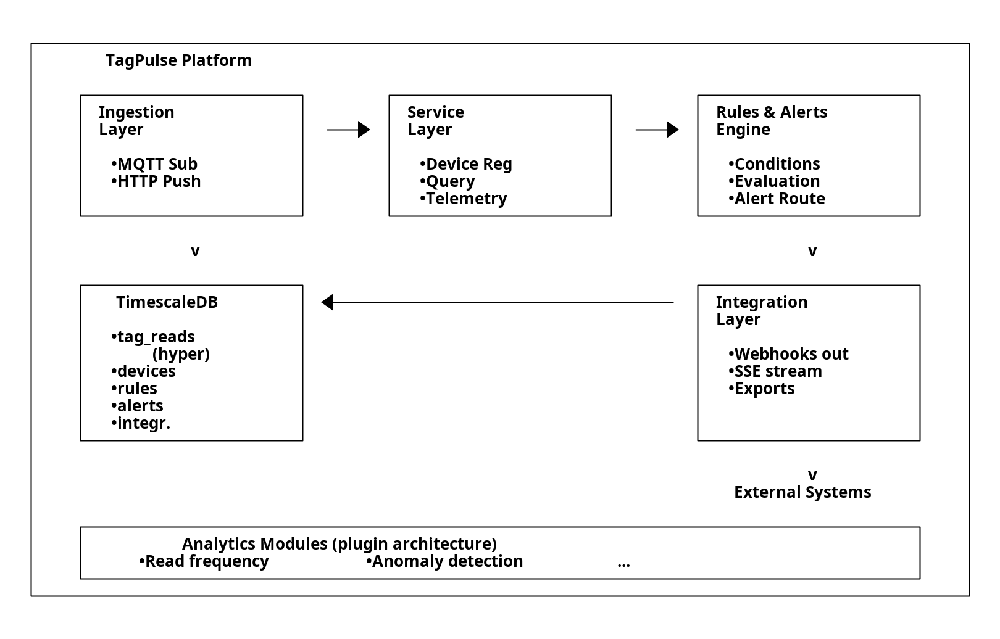

# TagPulse Architecture

> Logical view (services, domains, event flows). For the deployed Azure infrastructure (VNet, NSGs, ACA env, private endpoints, Bicep modules) see [azure-architecture.md](azure-architecture.md).

## System Overview



<details>
<summary>ASCII source (for editing)</summary>

```
+---------------------------------------------------------------------------+
|   TagPulse Platform                                                       |
|                                                                           |
|   +-----------------+      +-----------------+      +-----------------+   |
|   | Ingestion       |      | Service         |      | Rules & Alerts  |   |
|   | Layer           | ---> | Layer           | ---> | Engine          |   |
|   |                 |      |                 |      |                 |   |
|   | * MQTT Sub      |      | * Device Reg    |      | * Conditions    |   |
|   | * HTTP Push     |      | * Query         |      | * Evaluation    |   |
|   |                 |      | * Telemetry     |      | * Alert Route   |   |
|   +-----------------+      +-----------------+      +-----------------+   |
|          |                                                 |              |
|          v                                                 v              |
|   +-------------------------------------------------------------------+   |
|   | EventBus (internal pub/sub)                                       |   |
|   | * Capacity-limited queues   * Back-pressure policies              |   |
|   | * Phase 1: asyncio.Queue    * Phase 2: Redis Streams              |   |
|   +-------------------------------------------------------------------+   |
|          |                    |                            |              |
|          v                    v                            v              |
|   +-----------------+  +-----------------+         +-----------------+   |
|   | TimescaleDB     |  | Analytics       |         | Integration     |   |
|   |                 |  | Modules         |         | Layer           |   |
|   | * tag_reads     |  |                 |         |                 |   |
|   |   (hyper)       |  | * Read freq     |         | * Webhooks out  |   |
|   | * devices       |  | * Anomaly det   |         | * SSE stream    |   |
|   | * rules         |  | * ...           |         | * Exports       |   |
|   | * alerts        |  |                 |         |                 |   |
|   | * integr.       |  +-----------------+         +-----------------+   |
|   +-----------------+                                      v              |
|                                                    External Systems       |
+---------------------------------------------------------------------------+
```

</details>

To regenerate the PNG after editing the ASCII source:
```bash
java -Djava.awt.headless=true -jar /usr/share/ditaa/ditaa.jar /tmp/tagpulse-arch.txt docs/assets/architecture.png --no-shadows --scale 2
```

## Components

### Ingestion Layer
Accepts device telemetry via two protocols:
- **MQTT subscriber** — connects to external broker (EMQX/Mosquitto), subscribes to `devices/{device_id}/tag-reads` and `devices/{device_id}/status` topics
- **HTTP push endpoint** — `POST /tag-reads` for devices that can't speak MQTT

Both paths validate messages against Pydantic schemas, write to TimescaleDB, and publish events to the internal EventBus. See [ADR-002](adr/002-mqtt-device-connectivity.md).

### Service Layer
FastAPI REST API providing:
- **Device registry** — CRUD for reader registration, configuration profiles, status tracking
- **Query API** — tag read queries with filters (reader, tag, time range), pagination, aggregations
- **Telemetry monitoring** — live device status, recent reads, device health

All business logic lives in service functions, not route handlers (per `copilot-instructions.md`).

### Rules & Alerts Engine
Evaluates user-defined rules against incoming telemetry:
- **Conditions** — threshold breach, absence detection, rate change
- **Actions** — webhook call, email, internal notification queue
- **Scope** — per-device, per-group, or global

Runs in an async background worker to avoid contending with ingestion. See [ADR-005](adr/005-embedded-rules-engine.md).

### Integration Layer
Pushes data and events to external systems:
- **Outbound webhooks** — triggered by configurable events (alerts, device status changes)
- **SSE streaming** — real-time feed for external consumers
- **Scheduled exports** — periodic CSV/JSON to object storage or email

All targets configured via CRUD API. See [ADR-006](adr/006-webhook-integration-layer.md).

### Internal EventBus
Capacity-limited async pub/sub bus connecting producers (ingestion, rules engine) to consumers (rules engine, analytics, integration layer):
- **Protocol-based** — `EventBus` protocol with `publish()`, `subscribe()`, `start()`, `stop()` methods
- **Capacity limits** — configurable max queue size per topic (default 10,000), high-watermark warnings at 80%
- **Overflow policies** — `drop_oldest` (default), `drop_newest`, `block`, or `raise` when queues are full
- **Topics** — `tag_read.created`, `device.status_changed`, `alert.triggered`, `device.registered`, `device.decommissioned`
- **Phased implementation** — Phase 1: in-process `asyncio.Queue` → Phase 2: Redis Streams → Phase 3: Kafka/Redpanda

See [ADR-010](adr/010-internal-event-bus.md).

### Analytics Modules
Pluggable Python packages following a plugin pattern:
- Base class with registration and lifecycle hooks
- First module: read frequency analytics (reads/min, anomaly flagging)
- Subscribes to `tag_read.created` events via the EventBus
- Runs in background workers, shares DB connection pool

See [ADR-004](adr/004-monolith-plugin-analytics.md).

### Storage (TimescaleDB)
Single database engine for both time-series and relational data:

| Table | Type | Purpose |
|-------|------|---------|
| `tag_reads` | Hypertable | Time-series tag read events (auto-partitioned, compressed); EPC/TID/user-memory + location columns |
| `telemetry_readings` | Hypertable | Subject-scoped sensor metric stream keyed on `(tenant_id, subject_kind, subject_id, metric_name, timestamp)` (Sprint 18). Replaces the original `device_telemetry` hypertable, which was renamed to `telemetry_readings_legacy_device` and re-exposed as a back-compat view. See [design/subject-scoped-telemetry.md](design/subject-scoped-telemetry.md), ADR-013/014/015. |
| `telemetry_quarantine` | Regular | Rejected readings (capped 7 d retention); Sprint 18 added nullable `subject_kind` / `subject_id` |
| `stock_movements` | Hypertable | Append-only inventory ledger |
| `external_locations` | Hypertable | Positions pushed by TMS / mobile-carrier adapters |
| `alerts` | Hypertable | Alert history |
| `audit_logs` | Regular | Configuration change trail |
| `dead_letter_events` | Regular | Failed deliveries / parse errors |
| `tenants` / `users` | Regular | Identity + tracking_modes / tile_provider / db_pool_key |
| `devices` | Regular | Registry, configuration, mobility, token rotation, mTLS thumbprint |
| `assets` / `asset_tag_bindings` | Regular | Asset-tracking domain layer |
| `products` / `lots` / `stock_items` | Regular | Inventory-tracking domain layer (stock_items has parent_stock_item_id self-FK) |
| `sites` / `zones` | Regular | Shared substrate; `zones.polygon_geojson` + bbox columns drive geofencing |
| `subject_current_zone` | Regular | Durable dwell-tracker state (multi-worker safe) |
| `tag_data_mappings` | Regular | Per-tenant `tag_data` key → semantic field mapping |
| `rules` | Regular | User-defined rule definitions |
| `integrations` / `integration_deliveries` | Regular | Webhook/export targets + delivery log |
| `analytics_results` | Regular | Plugin module output |
| `tenant_usage_detail` / `tenant_quotas` | Regular | Multi-tenant metering |

All tenant-scoped tables enforce isolation via `tenant_id` FK + Postgres RLS policies. Full schema reference: [data-models.md](data-models.md). See also [ADR-003](adr/003-timescaledb-storage.md).

### Admin UI
React 19 + TypeScript + Vite SPA in a separate repo ([TagPulse-UI](https://github.com/9owlsboston/TagPulse-UI)). Served via nginx container on port 3000, proxies API calls to the backend via Docker network alias `api`. Includes dashboard, device management, telemetry charts, data explorer, rule wizard, integration config, usage/billing views, asset / site / zone management, geofence map (react-leaflet), inventory (products / lots / stock items), tag-data field mappings, audit log viewer, and tenant settings (tracking-modes toggle). See [ADR-007](adr/007-admin-ui-technology.md) and [design/admin-ui.md](design/admin-ui.md).

### Geofencing & Map
Polygon-zone evaluation runs in-process on every `tag_read.created` and `external_locations` insert: bbox prefilter → Shapely point-in-polygon. Per-zone enter/exit drives the unified `subject.zone_changed` event (`subject_kind` ∈ `asset` \| `stock_item` \| `device`). Dwell tracking persists state in `subject_current_zone` so `zone.dwell_exceeded` rules survive worker restarts. Map UI uses `MapConfigResolver` to honor `tenants.tile_provider`. PostGIS migration is gated on OTel-alert thresholds per [design/geofencing-and-map.md](design/geofencing-and-map.md).

### Device Identity
Three-phase roadmap per [ADR-011](adr/011-device-identity-roadmap.md): **Phase 1 — rotatable per-device tokens** (shipped, Sprint 16: `devices.token_hash` / `token_prefix` / `token_rotated_at`); **Phase 2 — mTLS** (in progress, Sprint 17b: `devices.cert_thumbprint`, broker rollout in Sprint 17c per [ADR-012](adr/012-mtls-for-mqtt.md)); **Phase 3 — hardware-backed keys** (backlog).

## Data Flow

```
1. Device sends tag read
   ├── MQTT: publish to devices/{id}/tag-reads
   └── HTTP: POST /tag-reads

2. Ingestion validates message (Pydantic schema)

3. Valid message written to tag_reads hypertable

4. Ingestion publishes TagReadCreated event → EventBus
   (capacity-limited; overflow policy applies if consumers lag)

5. EventBus fans out to subscribers:
   ├── Rules engine evaluates against active rules
   │   └── Match? → Create alert → publish AlertTriggered → EventBus
   └── Analytics modules compute aggregates, detect anomalies

6. Integration layer subscribes to AlertTriggered events
   ├── Webhooks fire on configured triggers
   ├── SSE streams live events to connected consumers
   └── Scheduled exports run on cron
```

## Key Decisions

| Decision | Reference |
|----------|-----------|
| Python + FastAPI backend | [ADR-001](adr/001-python-fastapi-backend.md) |
| MQTT for device connectivity | [ADR-002](adr/002-mqtt-device-connectivity.md) |
| TimescaleDB for storage | [ADR-003](adr/003-timescaledb-storage.md) |
| Monolith-first with plugin analytics | [ADR-004](adr/004-monolith-plugin-analytics.md) |
| Embedded rules engine | [ADR-005](adr/005-embedded-rules-engine.md) |
| Webhook-first integration | [ADR-006](adr/006-webhook-integration-layer.md) |
| Admin UI technology | [ADR-007](adr/007-admin-ui-technology.md) (proposed) |
| Multi-tenancy strategy | [ADR-008](adr/008-multi-tenancy-strategy.md) (proposed) |
| Containerization & local dev | [ADR-009](adr/009-containerization-local-dev.md) (proposed) |
| Internal event bus | [ADR-010](adr/010-internal-event-bus.md) (proposed) |
| Device identity roadmap | [ADR-011](adr/011-device-identity-roadmap.md) |
| mTLS for MQTT | [ADR-012](adr/012-mtls-for-mqtt.md) |

## External Dependencies

| Dependency | Role | Required? |
|-----------|------|-----------|
| MQTT Broker (EMQX / Mosquitto) | Device message transport. `:1883` plaintext always; `:8883` TLS opt-in via Sprint 28 C6 (`mqttTlsEnabled` Bicep param, server-auth only — mTLS for clients is deferred per [ADR-012](adr/012-mtls-for-mqtt.md)). | Yes |
| TimescaleDB | Data storage | Yes |
| SMTP server | Email alert delivery | Optional |
| Azure Monitor / Application Insights | Telemetry sink + alert action group (Sprint 28 D2). Default-off; staging/production enable via `AZURE_DEPLOY_ALERTS=true` + `AZURE_ALERT_EMAIL`. See [observability/slos.md](observability/slos.md) for the alert→runbook map. | Optional (recommended for any non-dev env) |

## Observability surface (Sprint 28)

Four SLO-aligned signals back the alert rules in `deploy/azure/bicep/modules/alerts.bicep`:

| Signal | Source | Alert (Bicep resource) | Runbook |
|---|---|---|---|
| MQTT subscriber `last_message_age_seconds` | OTel gauge (Sprint 28 C1) | `tp${env}-alert-mqtt-stalled` (SEV1, >10 min) | [mqtt-outage.md](runbooks/mqtt-outage.md) |
| `requests/failed` count | App Insights | `tp${env}-alert-availability-fast-burn` (SEV1, >50/1h) | [incident-template.md](runbooks/incident-template.md) |
| `requests/duration` p95 | App Insights | `tp${env}-alert-api-p95-latency` (SEV2, >500ms/30min) | [incident-template.md](runbooks/incident-template.md) |
| `tagpulse_dead_letter_events_total` | OTel counter (extends Sprint 27 with C3 `source` column) | `tp${env}-alert-dead-letter-burst` (SEV1, >200/1h) | [dead-letter-triage.md](runbooks/dead-letter-triage.md) |

KQL queries + the workbook live under [`ops/azure-monitor/`](../ops/azure-monitor/README.md).
SLO + burn-rate math: [observability/slos.md](observability/slos.md).

## Project Structure

```
src/tagpulse/
  api/            # FastAPI routes (thin handlers → service layer)
  ingestion/      # MQTT subscriber + HTTP push endpoint
  services/       # Business logic (devices, assets, inventory, geofencing, audit, …)
  models/         # SQLAlchemy models + Pydantic schemas (see docs/data-models.md)
  repositories/   # Storage protocol + implementations (see design/storage-strategy.md)
  events/         # EventBus protocol + implementations (see ADR-010)
  rules/          # Rule engine, conditions, alert routing
  analytics/      # Plugin analytics modules
  integrations/   # Webhooks, SSE, scheduled exports, TMS adapters
  geo/            # Polygon evaluation, bbox prefilter, MapConfigResolver
  rfid/           # EPC / TID / user-memory decoders, tag_data mapping
  workers/        # Background workers (dwell tracker, drain loops)
  core/           # Config, dependencies, auth, audit, shared utilities
```
