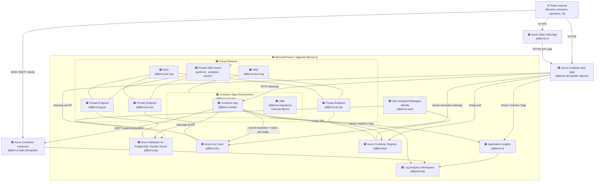

# TagPulse — Azure Architecture

> Physical / deployed view. For the logical design (services, domains, event flows) see [architecture.md](architecture.md).
> Source of truth: [`deploy/azure/bicep/`](../deploy/azure/bicep/). When in doubt, the Bicep wins; this doc summarizes it.
> Last verified: Sprint 28 (May 2026). Naming pattern: `tp${env}-*` where `env ∈ { dev, staging, prod }`.

---

## 1. At a glance



Directed arrows represent runtime data/control flow. Undirected links (`---`) represent infrastructure associations (network placement/binding, private-link topology, and RBAC role-assignment relationships such as UAMI ↔ ACR/KV).
`${env}` is a naming placeholder (`dev`, `staging`, `prod`).

The api Container App is the only resource with public ingress. Postgres, Key Vault, and ACR are reachable only via private endpoints inside the VNet. Mosquitto runs as a single Azure Container Instance with a public IP (port **1883, plaintext + username/password** today; mTLS on 8883 is the [ADR-012](adr/012-mtls-for-mqtt.md) workstream and has not shipped). Devices connect directly; the worker reads from it across the public FQDN.

Excalidraw source for this deployed-resource view: [`docs/assets/azure-deployed-resources.excalidraw`](assets/azure-deployed-resources.excalidraw).

---

## 2. Resource inventory

Every resource type currently provisioned by `deploy/azure/bicep/modules/`:

| Resource type | Bicep module | Per-env name | Why it exists |
|---|---|---|---|
| `Microsoft.Resources/resourceGroups` | `main.bicep` | `tagpulse-${env}-rg` | Single RG per env. All resources collocated. |
| `Microsoft.Network/virtualNetworks` | `network.bicep` | `tp${env}-vnet` (`10.10.0.0/16`) | One VNet per env. Three subnets — see §3. |
| `Microsoft.Network/networkSecurityGroups` | `network.bicep` | `tp${env}-aca-nsg`, `tp${env}-pe-nsg` | Default-deny inbound on `aca-infra`; allows AzureCloud:443 for Container Apps control plane. PE subnet NSG is empty by design (PEs bypass NSG). |
| `Microsoft.App/managedEnvironments` | `container-apps-env.bicep` | `tp${env}-aca-env` | One ACA env, VNet-injected into `aca-infra`. Hosts api, worker, jobs. |
| `Microsoft.App/containerApps` | `container-app.bicep` | `tp${env}-api`, `tp${env}-worker` | api: HTTP ingress (external), 1+ replicas. worker: no ingress, 1+ replicas, runs MQTT subscriber + EventBus consumers. |
| `Microsoft.App/jobs` | `migrations-job.bicep`, `tools-job.bicep` | `tp${env}-migrations`, `tools-job-${env}` | migrations: runs on `azd up`, `alembic upgrade head`. tools-job: manual trigger via `scripts/azd-job.sh`, runs any `scripts/*.py` against the live env from inside the VNet. |
| `Microsoft.ContainerInstance/containerGroups` | `mqtt.bicep` | `tp${env}-mqtt` | Eclipse Mosquitto. Public IP, TCP **1883** (plaintext + username/password — mTLS/8883 deferred to ADR-012). ACI not ACA because Container Apps' Envoy ingress is HTTP-only. Stateless: persistent state lives in PG; broker restarts drop retained messages, devices republish on reconnect. |
| `Microsoft.DBforPostgreSQL/flexibleServers` | `postgres.bicep` | `tp${env}-pg` | PG 15 + TimescaleDB. SKU `Standard_B1ms` (Burstable) in dev; size up for prod. **Public access disabled** — reachable only via PE in `pe` subnet. |
| `Microsoft.DBforPostgreSQL/flexibleServers/configurations` | `postgres.bicep` | — | `shared_preload_libraries = pg_cron,pg_stat_statements,timescaledb` (must include the platform defaults; setting just `timescaledb` would break extension load). |
| `Microsoft.DBforPostgreSQL/flexibleServers/databases` | `postgres.bicep` | `tagpulse` | The single application database. RLS policies declared in migrations (theatre — see repo memory note `tagpulse-conventions`; explicit tenant_id WHERE everywhere). |
| `Microsoft.KeyVault/vaults` | `keyvault.bicep` | `tp${env}-kv` | All non-Bicep secrets. **Public access disabled** — reachable via PE in `pe` subnet. RBAC mode (no access policies). |
| `Microsoft.KeyVault/vaults/secrets` | `keyvault.bicep` | `tagpulse-test-corp-admin-key`, `mqtt-broker-username`, `mqtt-broker-password`, `pg-admin-password`, `ui-deploy-token` | Per-env secret set. See `docs/runbooks/secret-rotation.md` (Sprint 28 B2). |
| `Microsoft.ContainerRegistry/registries` | `acr.bicep` | `tp${env}acr` | Basic SKU (~$5/mo, 10 GB). **Public access disabled** — reachable via PE. ACA pulls images via the env's UAMI with `AcrPull`. |
| `Microsoft.Network/privateEndpoints` (×3) | `private-endpoint.bicep` | `tp${env}-kv-pe`, `tp${env}-pg-pe`, `tp${env}-acr-pe` | One per private resource. All in `pe` subnet. |
| `Microsoft.Network/privateDnsZones` | `private-endpoint.bicep` | `privatelink.vaultcore.azure.net`, `privatelink.postgres.database.azure.com`, `privatelink.azurecr.io` | Standard PE DNS zones, linked to the env VNet. |
| `Microsoft.ManagedIdentity/userAssignedIdentities` | `identity.bicep` | `tp${env}-uami` | One UAMI shared by api, worker, both jobs, Mosquitto ACI. RBAC: `AcrPull` on ACR, `Key Vault Secrets User` on KV. |
| `Microsoft.Authorization/roleAssignments` | `identity.bicep`, others | — | The above two assignments + ad-hoc operator grants via `scripts/azd-grant-operator-kv.sh`. |
| `Microsoft.OperationalInsights/workspaces` | `monitoring.bicep` | `tp${env}-law` | Single Log Analytics workspace. ACA env logs here; App Insights also backed by it. 90-day retention. |
| `Microsoft.Insights/components` | `monitoring.bicep` | `tp${env}-ai` | Application Insights (workspace-based). Auto-instrumentation via OTel. |
| `Microsoft.Web/staticSites` | `static-web-app.bicep` | `tp${env}-ui` | Hosts the [TagPulse-UI](https://github.com/9owlsboston/TagPulse-UI) build. Free tier in dev; Standard for custom domain in prod. Deploy token rotated via `scripts/azd-ui-token-rotate.sh`. |

---

## 3. Network topology

VNet `tp${env}-vnet` = `10.10.0.0/16` (envs differ only by Bicep param; default leaves room for parallel envs at `10.20.x.x` / `10.30.x.x`).

| Subnet | CIDR | Delegated to | Holds |
|---|---|---|---|
| `aca-infra` | `10.10.0.0/23` | `Microsoft.App/environments` | Container Apps env (api, worker, jobs). /23 is the documented minimum for the consumption profile and leaves headroom for ~100+ replicas. NSG: default-deny inbound + allow `AzureCloud:443` (ACA control plane callback). |
| `pe` | `10.10.2.0/27` | none | Three private endpoints (KV, PG, ACR). Empty NSG by design (PEs bypass NSG). |
| `mgmt` | `10.10.3.0/27` | none | Reserved placeholder for Bastion / jumpbox. Bastion needs `/26` so this would expand to a parallel `AzureBastionSubnet` if enabled. Per ADR-017. |

Mosquitto's ACI (`tp${env}-mqtt`) is NOT in the VNet — it has a public IP. The worker connects to it via the public FQDN, same as devices. This was a Sprint 22/23 deliberate choice: ACI VNet integration would force a SKU upgrade and the broker is the *one* component that needs to be reachable from arbitrary device IPs anyway. Wire-level protection today: username + password (Sprint 23). mTLS on 8883 is [ADR-012](adr/012-mtls-for-mqtt.md), not yet shipped.

---

## 4. Identity & secrets flow

```
                 User-Assigned Managed Identity (tp${env}-uami)
                                  │
                ┌─────────────────┼─────────────────┐
                │                 │                 │
                ▼                 ▼                 ▼
            AcrPull          KV Secrets User     (future)
              ACR                  KV
              ▲                     ▲
              │ image pull          │ secret read at startup
              │                     │
       ┌──────┴──────┐    ┌─────────┴─────────┐
       │   ACA env   │    │ api / worker /    │
       │             │    │ migrations / tools│
       └─────────────┘    └───────────────────┘
                                  │
                                  ▼
                       Postgres password, MQTT
                       broker creds, etc. as
                       Container App `secrets`
                       (`secretRef` env vars)
```

- **No service principals at runtime.** All Azure-side auth is via the UAMI.
- **No password env vars in plaintext.** `secretRef` env vars resolve from Container App secrets, which themselves resolve from KV (`secureValue` references), which permits secret rotation without redeploying.
- **The api never touches KV directly at request time.** Secrets are resolved once at container start.
- **The tools-job is an exception** — it has explicit KV read capability via the UAMI so `scripts/get_kv_secret.py` can pull values inside the VNet (used by `scripts/azd-kv-get.sh`).

---

## 5. Data plane flows

| Flow | Source | Path | Sink |
|---|---|---|---|
| Device tag-read (MQTT) | RFID reader / Pi edge | TCP:1883 → Mosquitto (public, username+password) → worker (subscriber, in-VNet) → asyncpg over PE → PG `tag_reads` | TimescaleDB hypertable |
| Device tag-read (HTTP fallback) | RFID reader / Pi edge | HTTPS → api ingress → service layer → asyncpg over PE → PG | TimescaleDB hypertable |
| Browser → api | TagPulse-UI (Static Web App) | HTTPS → api ingress (CORS-allowed origin) | api |
| api ↔ DB | api Container App | asyncpg → PE → PG | PG |
| Worker ↔ DB | worker Container App | asyncpg → PE → PG | PG |
| Outbound webhook | EventBus consumer in worker | HTTPS → public internet → customer endpoint | external |
| OTel traces / metrics | api, worker | OTel exporter → App Insights (workspace-backed) → Log Analytics | LAW |
| Container Apps logs | all ACA workloads | platform → Log Analytics (`ContainerAppConsoleLogs_CL`) | LAW |
| ACI logs | Mosquitto | platform → Log Analytics | LAW |

---

## 6. What is NOT here (and why)

| Resource | Status | Notes |
|---|---|---|
| Azure Front Door / WAF | Not deployed | api ingress is direct. Gated on first regulated customer or DDoS-prone deployment. |
| Application Gateway | Not deployed | Same as above. ACA ingress = an Envoy edge already; doubling up would only add a WAF SKU. |
| Bastion | Not deployed | `mgmt` subnet is the placeholder. Operator ad-hoc DB access goes through `tools-job` instead. |
| Storage Account / Blob | Not deployed | No durable artifacts beyond ACR images and PG. Sprint 8 deferred CSV exports to "scheduled exports" (backlog) so no blob target needed yet. |
| Service Bus / Event Hubs | Not deployed | EventBus is in-process today (ADR-010). Promotes to a managed service when worker count > 1 demands cross-process delivery. |
| Azure Cache for Redis | Not deployed | No hot-path caching needed at current load. |
| Azure Front Door custom domain | Not deployed (dev) | Static Web App handles UI custom domain when we have one (Sprint 25 left this for prod). |
| Multi-region | Not deployed | Single-region (`southcentralus` default). DR is restore-in-place per [docs/runbooks/db-failover-and-restore.md](runbooks/db-failover-and-restore.md) (Sprint 28 E2). Cross-region active-passive is its own ADR. |
| Azure Monitor alert rules | Sprint 28 D2 (planned) | Until that lands, alerting is ad-hoc dashboards only. |
| Synthetic external probe | Not deployed | Availability is measured from inside the same region. Gated on first SLA. |

---

## 7. Per-env differences (dev → prod)

The Bicep is the same; parameters differ. Today the only meaningful per-env divergence:

| Param | dev | prod (target) |
|---|---|---|
| PG SKU | `Standard_B1ms` (Burstable) | `Standard_D2ds_v5` (GeneralPurpose) — gated on first paying load |
| PG storage | 32 GB | 128 GB+ |
| ACA min replicas (api) | 0 (scale-to-zero) | 1 |
| ACA min replicas (worker) | 1 (always-on for MQTT) | 1 |
| Static Web App tier | Free | Standard |
| Log retention | 30 days | 90 days |
| `enableVnetIntegration` | true | true |
| `disablePublicNetworkAccess` (KV/PG/ACR) | true | true |

---

## 8. Operator entry points

| I want to… | Use |
|---|---|
| Deploy a change | `azd deploy` (CI: `.github/workflows/deploy-azure.yml`) |
| Run a script in the live env | `scripts/azd-job.sh ${env} <script.py> -- <args>` |
| Read a KV secret from a laptop | `scripts/azd-kv-get.sh ${env} <secret-name>` |
| Rotate a tenant API key | `make rotate-key ENV=${env} TENANT=<slug>` (Sprint 28 F1) |
| Tail container logs | `make logs SERVICE=api ENV=${env}` (Sprint 28 F1) |
| Restart Mosquitto | `scripts/azd-mqtt-restart.sh ${env}` (Sprint 28 C5) |
| Run all health checks | `make doctor ENV=${env}` (Sprint 28 F3) |

---

## 9. Cross-references

- Bicep modules: [`deploy/azure/bicep/`](../deploy/azure/bicep/)
- Deploy runbook: [docs/runbooks/azure-first-deploy.md](runbooks/azure-first-deploy.md)
- Network cutover (Sprint 23): [docs/runbooks/sprint-23-network-cutover.md](runbooks/sprint-23-network-cutover.md)
- Tools-job pattern (Sprint 26): [docs/runbooks/operational-tooling.md](runbooks/operational-tooling.md)
- Logical architecture: [docs/architecture.md](architecture.md)
- ADR-017 network hardening: [docs/adr/017-network-hardening.md](adr/017-network-hardening.md)
- ADR-018 frontend cloud deployment: [docs/adr/018-frontend-cloud-deployment.md](adr/018-frontend-cloud-deployment.md)
